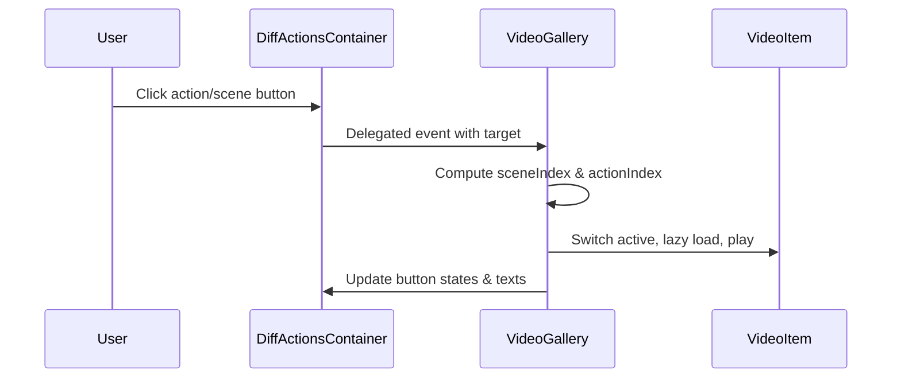

# 1. Problems

“不同动作”视频画廊的交互（按钮状态更新与视频切换）在两个文件中各自实现：`static/js/index.js` 与 `static/js/video-gallery.js`。这导致对同一组 DOM 节点重复绑定事件、状态更新逻辑分散，出现潜在的行为不一致与竞态。

## 1.1. **重复事件绑定与状态更新**
- 位置：
  - `static/js/index.js` 20-139 行：绑定 `#gallery-buttons-diff-actions` 与 `#gallery-buttons-diff-actions-scenes` 的点击事件，手动切换 `is-primary` 与视频播放。
  - `static/js/video-gallery.js` 242-265 行：在 `initGallery(..., 'diff-actions')` 中再次为同一按钮集合绑定点击事件，并调用 `handleVideoSwitch(..., 'diff-actions')` 完成状态与视频切换。
- 影响：同一点击会触发两套处理逻辑，带来以下问题：
  - 状态类的切换次序不一致，出现闪烁或“二次切换”。
  - 视频 `play/pause` 重复调用，容易出现播放被阻止、恢复时机异常等竞态。
  - 难以定位来源代码，增加回归与排错成本。
- 代表性代码：
```js
// static/js/index.js（片段）
sceneButtons.forEach((button, index) => {
  button.addEventListener('click', () => {
    updateTextButtons(index);
    sceneButtons.forEach(btn => btn.classList.remove('is-primary'));
    button.classList.add('is-primary');
    const actionButtons = document.querySelectorAll('#gallery-buttons-diff-actions .button');
    actionButtons.forEach((btn, i) => {
      btn.classList.toggle('is-primary', i === 0);
    });
    const videoIndex = index * 4;
    // ... 切换视频 ...
  });
});

// static/js/video-gallery.js（片段）
sceneButtons.forEach((button, sceneIdx) => {
  button.addEventListener('click', () => {
    const currentIndex = Array.from(container.querySelectorAll('.video-gallery-item')).indexOf(activeItem);
    const currentActionIndex = currentIndex % 4;
    const newIndex = sceneIdx * 4 + currentActionIndex;
    handleVideoSwitch(galleryCarouselId, newIndex, 'diff-actions');
  });
});
```

## 1.2. **文案更新与交互控制分散**
- 位置：`static/js/index.js` 21-56 行维护 `sceneTextButtons` 与 `updateTextButtons(sceneIndex)`；`video-gallery.js` 并不负责文案更新。
- 问题：同一交互的 UI 文案与状态切换分散在两个文件，未来变更需双处同步；一处遗漏即可造成文案与状态不一致。

## 1.3. **缺少统一“单一控制器”与事件委托**
- 现状：两处都采用逐按钮绑定（分别为 4 个动作按钮与 4 个场景按钮）。
- 问题：
  - 监听器数量偏多，易造成重复绑定与清理困难。
  - 缺少集中入口，不利于治理播放策略（懒加载、静音、失败兜底）的一致性。

# 2. Benefits

统一在 `video-gallery.js` 管理“不同动作”交互，并移除 `index.js` 的重复逻辑，可显著降低竞态与维护成本，同时保持对外可见行为不变。

## 2.1. **减少重复与复杂度**
- 预计“不同动作”相关的点击监听由原先两处逐按钮绑定（合计约 **16** 个监听）收敛为集中事件委托（**2** 个容器级监听）。
- 交互相关代码从 `index.js` 中移除约 **120** 行，职责更清晰。

## 2.2. **行为一致与更易回归**
- 状态切换、视频播放、懒加载在同一模块内统一实现，避免“二次切换”和播放竞态。
- 回归时只需围绕 `VideoGallery` 的入口与状态即可覆盖主要路径。

## 2.3. **更好的可测试性与扩展性**
- 单一控制器使得不同策略（如自动静音、失败重试、按钮文案映射）在一处配置与测试。
- 后续新增场景或动作，仅需扩展映射数据与索引计算。

# 3. Solutions

总体思路：引入“单一控制器 + 事件委托”，把“不同动作”相关的按钮状态与视频切换统一收敛到 `video-gallery.js`，`index.js` 仅保留通用初始化（carousel/slider 与其他折叠开关）。

## **3.1. 流程示意图（目标方案）**



说明：点击事件只通过容器转发到 `VideoGallery`，由其计算索引、切换视频并统一更新按钮状态与文案。

## 3.2. **统一由 VideoGallery 管理“不同动作”交互：解决“重复事件绑定与状态更新”与“文案分散”**

1) 方案概述
- 把 `sceneTextButtons` 文案映射与 `updateTextButtons` 迁入 `video-gallery.js`，统一在 `handleVideoSwitch(..., 'diff-actions')` 或其伴随的 UI 更新函数中完成。
- `index.js` 移除 20-139 行的“不同动作”交互代码，仅保留其他不相关的初始化与折叠逻辑。

2) 关键步骤
- 在 `video-gallery.js` 增加文案映射与更新函数：
```js
// video-gallery.js（新增）
const diffActionTexts = {
  0: ["Pour the jam onto the cake","Pour while moving & shaking","Pour while moving left & right","Pour much more jam"],
  1: ["Emit smoke","Breeze mildly towards left","Breeze strongly towards right","Breeze strongly towards left"],
  2: ["Breeze towards left","Breeze left & right","Breeze in mixed ways","Breeze in mixed ways"],
  3: ["Pull downward","Pull towards right","Pull towards left","Make the sand castle thinner"],
};

function updateDiffActionTexts(sceneIndex) {
  const textButtons = document.getElementById('gallery-buttons-diff-actions')
    .querySelectorAll('.button p');
  const texts = diffActionTexts[sceneIndex] || [];
  textButtons.forEach((p, i) => { if (texts[i]) p.textContent = texts[i]; });
}
```
- 在 `handleVideoSwitch(..., 'diff-actions')` 内，统一更新按钮状态与文案：
```js
// video-gallery.js（修改片段）
const actionIndex = index % 4;
const sceneIndex = Math.floor(index / 4);
textButtons.forEach(btn => btn.classList.remove('is-primary'));
sceneButtons.forEach(btn => btn.classList.remove('is-primary'));
if (textButtons[actionIndex]) textButtons[actionIndex].classList.add('is-primary');
if (sceneButtons[sceneIndex]) sceneButtons[sceneIndex].classList.add('is-primary');
updateDiffActionTexts(sceneIndex);
```
- 用事件委托替换逐按钮绑定：
```js
// video-gallery.js（替换逐按钮绑定为委托）
const diffActionsContainer = document.getElementById('gallery-buttons-diff-actions');
const scenesContainer = document.getElementById('gallery-buttons-diff-actions-scenes');

if (diffActionsContainer) {
  diffActionsContainer.addEventListener('click', (e) => {
    const button = e.target.closest('.button');
    if (!button) return;
    const activeItem = container.querySelector('.video-gallery-item.active');
    const currentIndex = Array.from(container.querySelectorAll('.video-gallery-item')).indexOf(activeItem);
    const currentSceneIndex = Math.floor(currentIndex / 4);
    const actionIdx = Array.from(diffActionsContainer.querySelectorAll('.button')).indexOf(button);
    const newIndex = currentSceneIndex * 4 + actionIdx;
    handleVideoSwitch(galleryCarouselId, newIndex, 'diff-actions');
  });
}

if (scenesContainer) {
  scenesContainer.addEventListener('click', (e) => {
    const button = e.target.closest('.scene-button');
    if (!button) return;
    const activeItem = container.querySelector('.video-gallery-item.active');
    const currentIndex = Array.from(container.querySelectorAll('.video-gallery-item')).indexOf(activeItem);
    const currentActionIndex = currentIndex % 4;
    const sceneIdx = Array.from(scenesContainer.querySelectorAll('.scene-button')).indexOf(button);
    const newIndex = sceneIdx * 4 + currentActionIndex;
    handleVideoSwitch(galleryCarouselId, newIndex, 'diff-actions');
  });
}
```

3) 修改前后对比
- 修改前：两处代码分别绑定监听与切换状态；文案只在 `index.js` 更新。
- 修改后：所有状态/文案/视频切换集中在 `VideoGallery`，通过委托减少监听器数量，避免重复触发。

## 3.3. **移除 index.js 的“不同动作”片段**

- 删除范围：`static/js/index.js` 20-139 行。
- 保留：`bulmaCarousel.attach`、`bulmaSlider.attach` 与后续折叠开关逻辑（141 行以后）。
- 若需最小改动，也可先注释该片段并标注“由 video-gallery 统一管理”。

# 4. Regression testing scope

本次变更只影响“不同动作”视频画廊的交互路径。应从用户点击到视频切换的端到端流程进行回归，重点关注按钮状态、文案更新与视频播放的一致性。

## 4.1. Main Scenarios
- 场景切换：点击任一场景按钮后——
  - 该场景按钮高亮；动作按钮重置为第一个高亮；文案按场景映射更新。
  - 视频切换到对应场景的第一个动作，懒加载源后静音播放。
- 动作切换：在某场景下点击动作按钮——
  - 该动作按钮高亮；场景按钮保持当前高亮；文案保持该场景映射。
  - 视频切换到对应索引，上一视频 `pause` 并 `currentTime=0`。
- 初始加载：首个活动项懒加载并播放；容器级委托仅触发一次处理，无重复监听影响。

可选用例结构（示例）：
- 预置：页面完整加载，`gallery-carousel-diff-actions` 存在。
- 操作：连续快速点击不同场景与动作。
- 预期：始终只有一个 `.video-gallery-item.active`；按钮状态与文案与索引一致；控制台无重复播放错误。

## 4.2. Edge Cases
- 快速连击与频繁切换：验证不会出现状态抖动或播放竞态（如双重 `play` 被阻止）。
- 懒加载失败：`source[data-src]` 不存在或网络错误时，日志输出且状态仍一致；无死循环重试。
- DOM 缺失：某容器不存在时，委托安全退出，不抛异常。
- 文案映射边界：新增场景或动作时，映射缺失不会影响现有切换（仅文案为空），提示在开发期完善配置。
